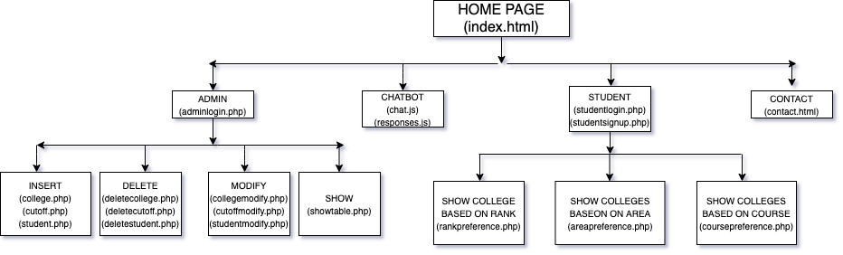

# TEAM-NEWBEES :bee:
**AMOC 2021**
**COLLEGE ADMISSION PREDICTOR**

A website with a database with college admission criterias and previous cut off marks, that helps students predict which colleges are most likely to accept their admission applications. This project is hand-coded for students across the country who wish to have an insight on which colleges they would most likely be accepted into based on their rank in a given entrance exam or other preferences like location of the college and course they want to pursue.

# Website Flow:

# Tech-Stack Components:
**Languages Used**
 * HTML
 * CSS
 * Javascript
 * PHP  

**Libraries Used**
 * Bootstrap
 * JQuery
 * AJAX  
 
**Server & Database**
 * Apache & MySql
